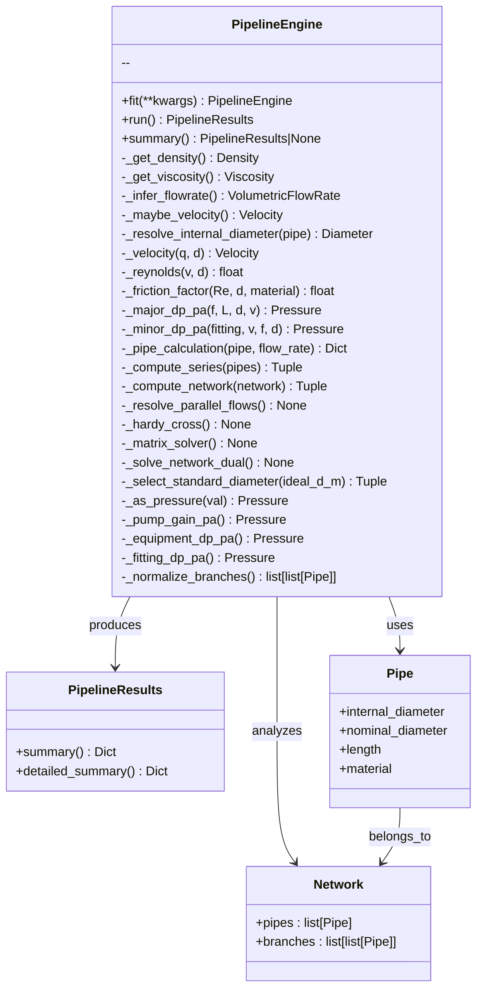

# Class: `PipelineEngine`

The **`PipelineEngine`** is the main interface for pipeline network analysis in ProcessPI.  
It performs **component-wise and network-wide calculations**, including **pressure drops, velocities, Reynolds numbers, friction factors**, and **optimum pipe sizing**.

---

## Methods

### **`fit()`**
Configures the `PipelineEngine` instance by processing input parameters, converting units, normalizing keys, and setting default values.

**Parameters**  
- `**kwargs`: Keyword arguments representing pipeline properties (`flowrate`, `diameter`, `velocity`, `length`) and solver configuration (`method`, `solver`).

**Functionality**
- **Data Initialization:** Stores inputs in `data` dictionary.  
- **Alias Mapping:** Normalizes input keys using a predefined `alias_map`.

| Key              | Aliases                                         |
|------------------|-------------------------------------------------|
| `flowrate`       | `flow_rate`, `q`, `Q`, `flowrate`               |
| `mass_flowrate`  | `mass_flow`, `m_dot`, `mdot`                    |
| `velocity`       | `v`                                             |
| `diameter`       | `dia`, `D`, `nominal_diameter`, `internal_diameter` |
| `length`         | `len`, `L`                                      |
| `inlet_pressure` | `in_pressure`, `pin`, `p_in`                    |
| `outlet_pressure`| `out_pressure`, `pout`, `p_out`                 |

- **Default Values:** Applies defaults for `assume_mm_for_numbers`, `flow_split`, `tolerance_m3s`, `pump_efficiency`, `method`, `hw_coefficient`, and `solver`.  
- **Network Validation:** Validates that `network` is a `PipelineNetwork` instance.  
- **Attribute Binding:** Binds normalized parameters (`flowrate`, `mass_flowrate`, `velocity`, `diameter`) as instance attributes.

**Returns**  
- `PipelineEngine`: Configured instance for method chaining.

**Raises**  
- `TypeError`: If `network` is not a `PipelineNetwork`.

---

### **`run()`**
Executes the pipeline simulation based on inputs from `fit()`.  
Chooses between **Network Mode** or **Single Pipe Mode**.

**Parameters**  
- None (relies on `data` populated by `fit()`).

**Returns**  
- `PipelineResults`: Encapsulates simulation results.

**Core Logic**
- **Network Mode** (with `network` object):  
  - Diameter Check → Auto-sizing if missing  
  - Flowrate Assignment → Distributes flow  
  - Network Solving → Pressure drop, head, pump power  

- **Single Pipe Mode** (without `network`):  
  - If no diameter → Solves for optimum diameter  
  - If diameter present → Standard hydraulic calculation  

**Results Output**  
- Consolidates into `results_out` → returned as `PipelineResults`.

---

### **`summary()`**
Retrieves a summary of the most recent simulation.

**Parameters**  
- None  

**Functionality**
- Checks if `_results` exists  
- Returns summary from `PipelineResults` or `None`

**Returns**  
- `PipelineResults` (summary) or `None`

---

## Engine Helper Functions

These private helper methods are used internally by the `PipelineEngine` class to retrieve properties and perform the core hydraulic calculations for both single pipes and entire networks.

---

### 🔹 Property Resolvers

#### **`_get_density`**
- Retrieves or infers fluid density.  
- **Returns:** `Density`  
- **Raises:** `ValueError` if not available.

#### **`_get_viscosity`**
- Retrieves or infers viscosity.  
- **Returns:** `Viscosity`  
- **Raises:** `ValueError` if not available.

#### **`_infer_flowrate`**
- Infers volumetric flow rate from:
  - Direct `flowrate`
  - `mass_flowrate` + density
  - `velocity` + `diameter`  
- **Returns:** `VolumetricFlowRate`  
- **Raises:** `ValueError` if inference fails.

#### **`_maybe_velocity`**
- Ensures velocity is available.  
- Calculates from `flowrate` and `diameter` if missing.  
- **Returns:** `Velocity`  
- **Raises:** `ValueError` if data is insufficient.

#### **`_resolve_internal_diameter`**
Determines the internal diameter of a pipe using a priority order:
1. `pipe.internal_diameter` (explicitly defined)  
2. `pipe.nominal_diameter` (nominal size)  
3. `engine.diameter` (default from `fit`)  
4. **Fallback:** Calculates hydraulically optimum diameter  

- **Parameters:** `pipe (Optional[Pipe])`  
- **Returns:** `Diameter`  

---

### 🔹 Primitive Calculators

#### **`_velocity`**
- **Purpose:** Calculates fluid velocity.  
- **Parameters:** `q (VolumetricFlowRate)`, `d (Diameter)`  
- **Returns:** `Velocity`  

#### **`_reynolds`**
- **Purpose:** Computes Reynolds number to determine flow regime.  
- **Parameters:** `v (Velocity)`, `d (Diameter)`  
- **Returns:** `float`  

#### **`_friction_factor`**
- **Purpose:** Friction factor using Colebrook-White correlation.  
- **Parameters:** `Re (float)`, `d (Diameter)`, `material (Optional[str])`  
- **Returns:** `float`  

#### **`_major_dp_pa`**
- **Purpose:** Major pressure drop due to friction.  
- **Parameters:** `f (float)`, `L (Length)`, `d (Diameter)`, `v (Velocity)`  
- **Returns:** `Pressure (Pa)`  

#### **`_minor_dp_pa`**
- **Purpose:** Minor losses due to fittings (elbows, valves, etc.).  
- **Priority Order:**  
  1. **K-Factor** (explicit)  
  2. **Equivalent Length**  
  3. **Standards Lookup** (fallback)  

- **Parameters:** `fitting (Fitting)`, `v (Velocity)`, `f (Optional[float])`, `d (Diameter)`  
- **Returns:** `Pressure (Pa)`  

---

### 🔹 Composite Calculator

#### **`_pipe_calculation`**
Orchestrates all primitives to perform full pipe analysis.

**Functionality**
1. Resolves diameter & flow (via `_resolve_internal_diameter`, `_infer_flowrate`).  
2. Computes Reynolds number & friction factor.  
3. Calculates **major losses**, **minor losses**, and **elevation effects**.  
4. Aggregates results into a structured output.  

**Parameters:** `pipe (Pipe)`, `flow_rate (Optional[VolumetricFlowRate])`  
**Returns:** `Dict[str, Any]` → Includes:
- Diameter  
- Velocity  
- Reynolds number  
- Major losses  
- Minor losses  
- Elevation losses  
- Total pressure drop  

---
### **Series and Network Evaluation**

#### `_compute_series`
- **Purpose:** Calculates the total pressure drop for a series of pipes. In a series, the flow rate is constant, and the total pressure drop is the sum of the pressure drops of each individual pipe and its fittings.  
- **Normalization:** It intelligently handles various inputs (a single Pipe, a list of Pipes, or a list of branches) by flattening them into a single series of pipes before calculation.  
- **Returns:** A tuple containing the total pressure drop, a list of detailed reports for each pipe, and a summary of the series.  

#### `_compute_network`
- **Purpose:** Serves as a high-level function for calculating the total pressure drop of a more complex network. It normalizes the network structure into a list of branches before performing calculations.  
- **Logic:** It iterates through each branch and calls `_pipe_calculation` to get the pressure drop for each pipe within that branch. It then aggregates these results to provide a comprehensive report for the entire network.  
- **Returns:** A tuple containing the total network pressure drop, a list of all element reports, and a network summary.  

---

### **Network Solvers**

#### `_resolve_parallel_flows`
- **Purpose:** This is an iterative solver for parallel networks. It balances the flow rates between parallel branches until the pressure drop across all branches converges to a single value within a specified tolerance.  
- **Logic:** It starts with an initial guess (usually an equal flow split), calculates the pressure drop for each branch, and then adjusts the flow rates to reduce the difference in pressure drops. This process repeats until a stable solution is found.  

#### `_hardy_cross`
- **Purpose:** Implements the Hardy-Cross method, a classic iterative approach for solving flow and pressure problems in pipe networks, especially those with loops.  
- **Logic:** It computes the flow corrections needed for each loop to satisfy the principle that the sum of head losses around any closed loop must be zero. This is a robust method for complex, interconnected systems.  

#### `_matrix_solver` and `_solve_network_dual`
- **Purpose:** These functions provide alternative, iterative methods for solving complex parallel networks. They use a similar principle to the Hardy-Cross method, iteratively adjusting branch flow rates to balance the pressure drops until the solution converges.  

---

### **Utility Helpers**

- **`_select_standard_diameter`**: Maps an ideal calculated diameter to the nearest available standard pipe size.  
- **`_as_pressure`**: Ensures that a given input is correctly converted to a Pressure object with a specified unit.  
- **`_pump_gain_pa`**: Calculates the pressure gain provided by a pump, converting from either head or inlet/outlet pressure values.  
- **`_equipment_dp_pa`**: Handles the pressure drop of non-pipe equipment, such as filters or heat exchangers, converting units as needed.  
- **`_fitting_dp_pa`**: A specialized helper for calculating the pressure drop of a single fitting using K-factors or equivalent lengths.  
- **`_normalize_branches`**: A crucial function for preparing network data. It takes various network inputs and flattens them into a consistent, nested list structure (`list[list[Pipe]]`), making them ready for the solvers.  

---

## ✅ Key Features

### 1. Single Pipeline Analysis
- Pressure drop & flow rate via:
  - **Darcy–Weisbach** (precise)  
  - **Hazen–Williams** (quick for water)  
- Accounts for elevation, roughness, fittings, valves.

### 2. Network Analysis
- Branched/looped networks using:
  - Hardy–Cross iteration  
  - Direct matrix solver  
- Supports plant utility networks, firewater loops, cooling systems.

### 3. Component Loss Modeling
- Inline equipment & fittings (valves, bends, tees, orifices).  
- Uses **K-factor data** for accurate modeling.

### 4. Elevation & Static Head
- Includes elevation effects.  
- Suitable for tanks, hilly terrains, sump transfers.

### 5. Multiple Solver Options

| Solver            | Best For                       | Notes                            |
|-------------------|--------------------------------|----------------------------------|
| Darcy–Weisbach    | Precise engineering calcs       | Custom fluid properties supported |
| Hazen–Williams    | Quick water line checks         | Assumes low viscosity             |
| Hardy–Cross       | Small networks (≤10 pipes)      | Simple, easy debugging            |
| Matrix Solver     | Moderate networks with loops    | Robust, faster                    |

### 6. Typical Use Cases
- Utility water networks  
- Chemical transfer lines  
- Cooling water loops  
- Firewater ring mains  
- Static head studies  

### 7. Current Limitations
- Steady-state only  
- Single-phase only  
- Constant density/viscosity  
- No pump curves  
- Limited to ~50 pipes  

### 8. Planned Roadmap

| Stage        | Feature                                      |
|--------------|----------------------------------------------|
| Short-term   | Newton–Raphson solver for larger networks    |
| Mid-term     | Pump curve integration + auto pump point     |
| Mid-term     | Compressible (gas) network support           |
| Long-term    | Dynamic/transient (surge, water hammer)      |
| Long-term    | Two-phase and slurry flow models             |

---

## 💻 Example Usage

### Example 1 – Dry Chlorine Gas Pipeline

```python
from processpi.components import *
from processpi.units import *
from processpi.pipelines.engine import PipelineEngine

# Define fluid and mass flow
fluid = Chlorine(temperature=Temperature(20, "C"), pressure=Pressure(6, "atm"))
mass_flow = MassFlowRate(10000, "kg/h")

print(fluid.density())

# Create engine without an explicit network
model = PipelineEngine()
model.fit(
    fluid=fluid,
    mass_flow=mass_flow
    # realistic pipe length can be added
)
results = model.run()  # auto diameter sizing
results.summary()
results.detailed_summary()
```

---

## 📌 UML-Style Diagram


